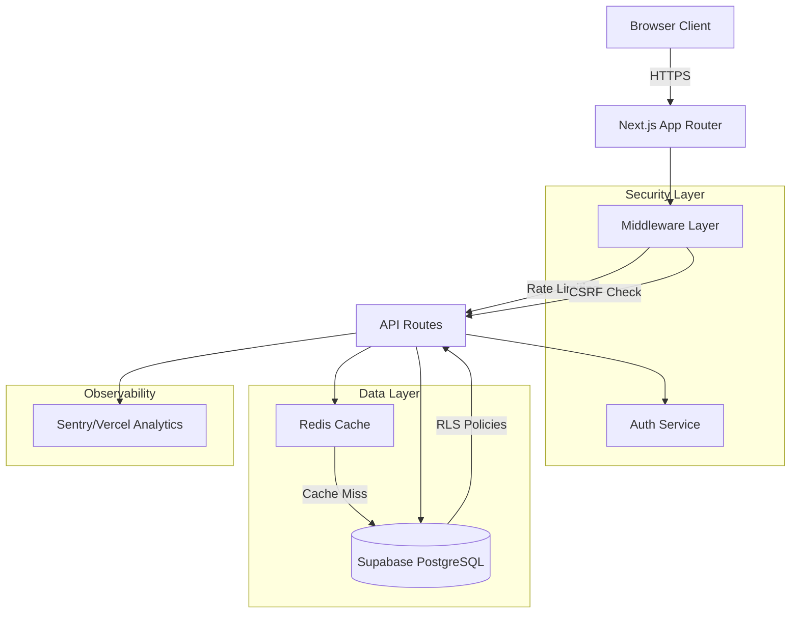

# Design Document: World-Class Audit & Improvement Initiative

## Overview

This design document outlines the comprehensive technical approach for transforming the FinanceOS Personal Finance Dashboard into a world-class, production-ready application. The implementation spans 8 critical areas: Security & Compliance, Code Quality & Architecture, Testing Strategy, Performance Optimization, Observability & Monitoring, Documentation & Developer Experience, DevOps & CI/CD, and Accessibility & UX Polish.

### Design Principles

1. **Security First**: All changes prioritize security and data protection
2. **Incremental Adoption**: Changes can be implemented progressively without breaking existing functionality
3. **Developer Experience**: Tools and patterns should enhance, not hinder, development velocity
4. **Measurable Quality**: All improvements must have clear, measurable success metrics
5. **Production Readiness**: Every component must meet production-grade standards
6. **Maintainability**: Code should be self-documenting, testable, and easy to modify

### Technology Stack

**Core Framework**: Next.js 16 (App Router), React 19, TypeScript 5.x  
**Database**: Supabase (PostgreSQL with Row-Level Security)  
**Caching**: Redis (for session data, frequently accessed data)  
**Testing**: Jest (unit), Playwright (E2E), fast-check (property-based), Storybook (visual)  
**Observability**: Sentry (errors), Vercel Analytics (performance), Pino (logging)  
**CI/CD**: GitHub Actions, Vercel (deployment)  
**Documentation**: OpenAPI 3.1, Storybook, Markdown (ADRs/runbooks)  
**Security**: OWASP best practices, Snyk (dependency scanning), next-safe (headers)  
**Code Quality**: ESLint, Prettier, TypeScript strict mode, SonarQube (optional)

## Architecture

### High-Level Architecture



### Layered Architecture Pattern

The application follows a layered architecture to enforce separation of concerns:

1. **Presentation Layer** (React Components)
   - UI components (shadcn/ui)
   - Client-side state management
   - Form validation and user interactions

2. **API Layer** (Next.js API Routes)
   - Request validation and sanitization
   - Business logic orchestration
   - Response formatting

3. **Service Layer** (Business Logic)
   - Domain-specific operations
   - Data transformation and aggregation
   - External service integration

4. **Data Access Layer** (Repository Pattern)
   - Database queries and mutations
   - Cache management
   - Data mapping

5. **Infrastructure Layer**
   - Authentication/authorization
   - Logging and monitoring
   - Error handling
   - Rate limiting and security

## Components and Interfaces

### 1. Security & Compliance Components

#### Rate Limiting Middleware

**Purpose**: Prevent API abuse and DDoS attacks using token bucket algorithm

**Interface**:
```typescript
interface RateLimitConfig {
  maxRequests: number;      // Maximum requests per window
  windowMs: number;          // Time window in milliseconds
  skipSuccessfulRequests?: boolean;
  keyGenerator?: (req: Request) => string;  // Generate rate limit key (IP, user ID, etc.)
}

interface RateLimiter {
  check(key: string): Promise<RateLimitResult>;
  reset(key: string): Promise<void>;
}

interface RateLimitResult {
  allowed: boolean;
  remaining: number;
  resetAt: Date;
}
```

**Implementation Strategy**:
- Use Redis for distributed rate limiting (supports multiple server instances)
- Implement sliding window counter algorithm for accurate rate limiting
- Different limits for authenticated vs. anonymous users
- Per-endpoint configuration (e.g., /api/sync: 10/min, /api/reports: 60/hour)
- Return standard HTTP 429 with `Retry-After` and `X-RateLimit-*` headers


#### Input Validation and Sanitization

**Purpose**: Prevent injection attacks (XSS, SQL injection, command injection)

**Interface**:
```typescript
interface ValidationSchema {
  type: 'string' | 'number' | 'boolean' | 'object' | 'array';
  required?: boolean;
  min?: number;
  max?: number;
  pattern?: RegExp;
  sanitize?: (value: any) => any;
  validate?: (value: any) => boolean | string;
}

interface Validator {
  validate<T>(data: unknown, schema: Record<string, ValidationSchema>): ValidationResult<T>;
  sanitize(input: string): string;
}

interface ValidationResult<T> {
  success: boolean;
  data?: T;
  errors?: ValidationError[];
}

interface ValidationError {
  field: string;
  message: string;
  code: string;
}
```

**Implementation Strategy**:
- Use Zod for runtime type validation and schema definition
- Sanitize all string inputs using DOMPurify or similar
- Validate all numeric inputs for range and type
- Use parameterized queries (prepared statements) for all database operations
- Whitelist allowed characters for specific fields (e.g., account names, transaction descriptions)


#### Security Headers Configuration

**Purpose**: Implement defense-in-depth with comprehensive HTTP security headers

**Configuration**:
```typescript
const securityHeaders = {
  // Prevent XSS attacks
  'Content-Security-Policy': [
    "default-src 'self'",
    "script-src 'self' 'unsafe-inline' 'unsafe-eval' https://va.vercel-scripts.com",
    "style-src 'self' 'unsafe-inline'",
    "img-src 'self' data: https:",
    "font-src 'self' data:",
    "connect-src 'self' https://*.supabase.co wss://*.supabase.co",
    "frame-ancestors 'none'"
  ].join('; '),
  
  // Prevent clickjacking
  'X-Frame-Options': 'DENY',
  
  // Prevent MIME type sniffing
  'X-Content-Type-Options': 'nosniff',
  
  // Enable browser XSS protection
  'X-XSS-Protection': '1; mode=block',
  
  // Enforce HTTPS
  'Strict-Transport-Security': 'max-age=31536000; includeSubDomains; preload',
  
  // Referrer policy
  'Referrer-Policy': 'strict-origin-when-cross-origin',
  
  // Permissions policy
  'Permissions-Policy': 'geolocation=(), microphone=(), camera=()'
};
```

**Implementation Strategy**:
- Apply security headers in Next.js middleware for all routes
- Use next-safe package for easy security header management
- Test headers using securityheaders.com and Mozilla Observatory
- Document exceptions to CSP with justification


#### Row-Level Security (RLS) Policies

**Purpose**: Ensure data isolation between users at the database level

**Implementation Strategy**:
- Enable RLS on all tables containing user data
- Create policies for SELECT, INSERT, UPDATE, DELETE operations
- Use Supabase auth.uid() to restrict access to user's own data
- Example policies:

```sql
-- Users can only read their own data
CREATE POLICY "Users can view own data" ON transactions
  FOR SELECT
  USING (auth.uid() = user_id);

-- Users can only insert their own data
CREATE POLICY "Users can insert own data" ON transactions
  FOR INSERT
  WITH CHECK (auth.uid() = user_id);

-- Users can only update their own data
CREATE POLICY "Users can update own data" ON transactions
  FOR UPDATE
  USING (auth.uid() = user_id)
  WITH CHECK (auth.uid() = user_id);

-- Users can only delete their own data
CREATE POLICY "Users can delete own data" ON transactions
  FOR DELETE
  USING (auth.uid() = user_id);
```

**Tables requiring RLS**:
- accounts
- transactions
- budgets
- family_members
- investments (stocks, bonds, fno, alternative_assets)


#### Authentication & Session Management

**Purpose**: Secure user authentication with Supabase Auth

**Interface**:
```typescript
interface AuthService {
  getCurrentUser(): Promise<User | null>;
  verifySession(token: string): Promise<SessionVerification>;
  refreshSession(): Promise<Session>;
  logout(): Promise<void>;
}

interface SessionVerification {
  valid: boolean;
  user?: User;
  expiresAt?: Date;
}
```

**Implementation Strategy**:
- Use Supabase Auth for authentication (OAuth providers + email/password)
- Store session tokens in httpOnly cookies
- Implement automatic token refresh before expiration
- Server-side session verification for all protected routes
- Redirect to login page when session expires
- Implement "Remember Me" with longer session duration (optional)

### 2. Code Quality & Architecture Components

#### Error Handling System

**Purpose**: Consistent, type-safe error handling across the application

**Interface**:
```typescript
// Base error types
class AppError extends Error {
  constructor(
    message: string,
    public code: string,
    public statusCode: number,
    public isOperational: boolean = true
  ) {
    super(message);
    this.name = this.constructor.name;
    Error.captureStackTrace(this, this.constructor);
  }
}

class ValidationError extends AppError {
  constructor(message: string, public fields: Record<string, string>) {
    super(message, 'VALIDATION_ERROR', 400);
  }
}

class AuthenticationError extends AppError {
  constructor(message: string = 'Authentication required') {
    super(message, 'AUTH_ERROR', 401);
  }
}

class AuthorizationError extends AppError {
  constructor(message: string = 'Insufficient permissions') {
    super(message, 'AUTHZ_ERROR', 403);
  }
}

class NotFoundError extends AppError {
  constructor(resource: string) {
    super(`${resource} not found`, 'NOT_FOUND', 404);
  }
}

class DatabaseError extends AppError {
  constructor(message: string, public query?: string) {
    super(message, 'DATABASE_ERROR', 500, false);
  }
}
```


**Error Handler Middleware**:
```typescript
interface ErrorHandler {
  handleError(error: Error, context: RequestContext): ErrorResponse;
  isOperationalError(error: Error): boolean;
}

interface ErrorResponse {
  error: {
    code: string;
    message: string;
    details?: any;
    requestId?: string;
  };
}

interface RequestContext {
  requestId: string;
  userId?: string;
  path: string;
  method: string;
}
```

**Implementation Strategy**:
- Wrap all async operations in try-catch blocks
- Use Result type pattern for functions that can fail
- Implement global error boundary in Next.js (error.tsx)
- Log all errors to Sentry with full context
- Return user-friendly error messages (never expose internal details)
- Distinguish operational errors (expected) from programmer errors (bugs)

#### Repository Pattern for Data Access

**Purpose**: Abstract database operations and enable testability

**Interface**:
```typescript
interface Repository<T, ID> {
  findById(id: ID): Promise<T | null>;
  findAll(filters?: QueryFilters): Promise<T[]>;
  create(data: Omit<T, 'id'>): Promise<T>;
  update(id: ID, data: Partial<T>): Promise<T>;
  delete(id: ID): Promise<boolean>;
}

interface QueryFilters {
  where?: Record<string, any>;
  orderBy?: Array<{ field: string; direction: 'asc' | 'desc' }>;
  limit?: number;
  offset?: number;
}
```


**Example Implementation**:
```typescript
class TransactionRepository implements Repository<Transaction, string> {
  constructor(private db: SupabaseClient) {}
  
  async findById(id: string): Promise<Transaction | null> {
    const { data, error } = await this.db
      .from('transactions')
      .select('*')
      .eq('id', id)
      .single();
    
    if (error) throw new DatabaseError(error.message);
    return data;
  }
  
  async findAll(filters?: QueryFilters): Promise<Transaction[]> {
    let query = this.db.from('transactions').select('*');
    
    if (filters?.where) {
      Object.entries(filters.where).forEach(([key, value]) => {
        query = query.eq(key, value);
      });
    }
    
    if (filters?.orderBy) {
      filters.orderBy.forEach(({ field, direction }) => {
        query = query.order(field, { ascending: direction === 'asc' });
      });
    }
    
    if (filters?.limit) query = query.limit(filters.limit);
    if (filters?.offset) query = query.range(filters.offset, filters.offset + (filters.limit || 10) - 1);
    
    const { data, error } = await query;
    if (error) throw new DatabaseError(error.message);
    return data || [];
  }
  
  // ... other methods
}
```

**Benefits**:
- Easy to mock for unit testing
- Centralized database logic
- Consistent error handling
- Easy to add caching layer
- Supports multiple data sources


#### Dependency Injection Container

**Purpose**: Enable loose coupling and testability

**Interface**:
```typescript
interface Container {
  register<T>(key: string, factory: () => T): void;
  resolve<T>(key: string): T;
  singleton<T>(key: string, factory: () => T): void;
}

// Service registration
const container = new Container();

container.singleton('supabase', () => createClient(...));
container.singleton('cache', () => new RedisCache(...));
container.register('transactionRepo', () => 
  new TransactionRepository(container.resolve('supabase'))
);
container.register('transactionService', () => 
  new TransactionService(
    container.resolve('transactionRepo'),
    container.resolve('cache')
  )
);
```

**Implementation Strategy**:
- Use a lightweight DI container (tsyringe or custom)
- Register all services and repositories in a central location
- Inject dependencies through constructors
- Makes testing easier (mock dependencies)
- Supports lazy initialization

### 3. Testing Infrastructure Components

#### Unit Testing Setup

**Purpose**: Test individual functions and components in isolation

**Testing Stack**:
- **Test Runner**: Jest 29+ with TypeScript support
- **Assertion Library**: Jest built-in matchers + jest-extended
- **Mocking**: Jest mocks for functions, modules
- **Coverage**: Istanbul/NYC integrated with Jest


**Test Organization**:
```
src/
  lib/
    validators.ts
    validators.test.ts
  services/
    transaction-service.ts
    transaction-service.test.ts
  repositories/
    transaction-repository.ts
    transaction-repository.test.ts
```

**Example Unit Test**:
```typescript
describe('TransactionService', () => {
  let service: TransactionService;
  let mockRepo: jest.Mocked<TransactionRepository>;
  let mockCache: jest.Mocked<CacheService>;
  
  beforeEach(() => {
    mockRepo = {
      findById: jest.fn(),
      findAll: jest.fn(),
      create: jest.fn(),
      update: jest.fn(),
      delete: jest.fn(),
    } as any;
    
    mockCache = {
      get: jest.fn(),
      set: jest.fn(),
      delete: jest.fn(),
    } as any;
    
    service = new TransactionService(mockRepo, mockCache);
  });
  
  describe('getTransaction', () => {
    it('should return cached transaction if available', async () => {
      const cachedTransaction = { id: '1', amount: 100 };
      mockCache.get.mockResolvedValue(cachedTransaction);
      
      const result = await service.getTransaction('1');
      
      expect(result).toEqual(cachedTransaction);
      expect(mockCache.get).toHaveBeenCalledWith('transaction:1');
      expect(mockRepo.findById).not.toHaveBeenCalled();
    });
    
    it('should fetch from database on cache miss', async () => {
      const dbTransaction = { id: '1', amount: 100 };
      mockCache.get.mockResolvedValue(null);
      mockRepo.findById.mockResolvedValue(dbTransaction);
      
      const result = await service.getTransaction('1');
      
      expect(result).toEqual(dbTransaction);
      expect(mockCache.set).toHaveBeenCalledWith('transaction:1', dbTransaction, 3600);
    });
  });
});
```

