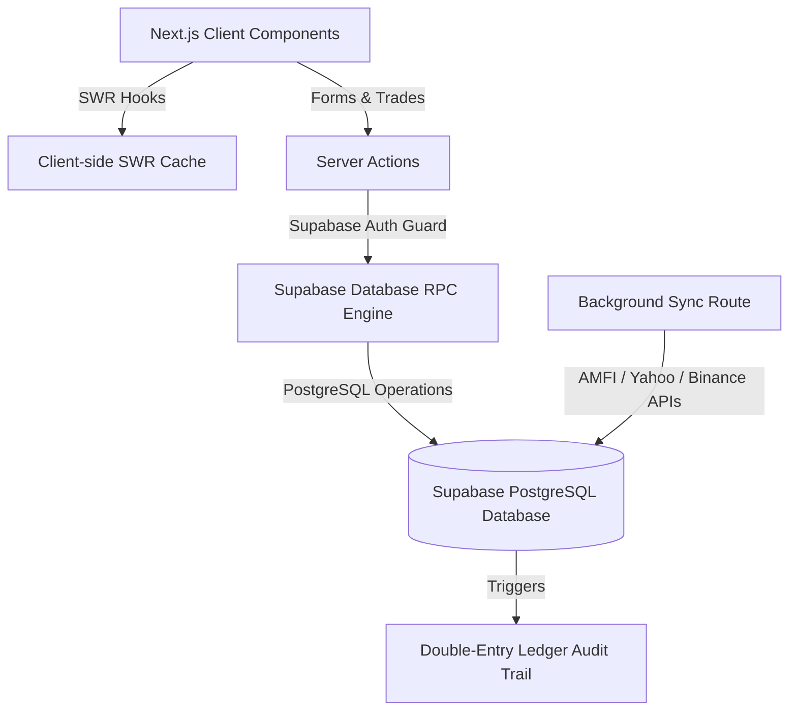

# System Architecture & Documentation: FinanceOS

Welcome to the architectural specification and technical documentation for **FinanceOS**—a premium, high-fidelity personal wealth dashboard and asset tracking platform.

---

## 1. System Overview

FinanceOS is designed as a secure, local-first reporting interface for tracking multi-class assets across global portfolios.



---

## 2. Technical Stack & Core Patterns

The application is structured as a progressive web application (PWA) using the following stack:
1. **Frontend Core**: Next.js App Router (React Server Components + interactive Client Components) styled with **Vanilla CSS** tokens.
2. **State & Hydration**: Client-side state hydration is managed using **SWR (Stale-While-Revalidate)** to deliver instant rendering and background polling.
3. **Database Layer**: **PostgreSQL** hosted on Supabase. **Drizzle ORM** is used strictly for declarative schema definitions and migration generations; runtime queries are executed using **Supabase CLI-generated types** and **database-level SQL RPC functions**.
4. **Caching & Session Logging**: Redis caching for rate-limiting and query validation logs.
5. **Real-time Price Engines**: Direct server-to-server endpoints (AMFI for Mutual Funds, Binance for Cryptocurrencies, and Yahoo Finance for Equities).

---

## 3. Directory Structure

```
src/
├── app/                  # Next.js App Router folders
│   ├── api/              # API endpoints (cron sync routes, CSV export routes)
│   ├── dashboard/        # Dashboard viewports (stocks, mutual-funds, crypto, forex)
│   └── login/            # Authentication portals
├── components/           # Reusable global design UI modules (Drawer, skeletons, onboarding)
├── context/              # Context providers (User context, Theme context)
├── db/                   # Drizzle ORM schema mapping
├── hooks/                # Custom React hooks (useFinanceData, useNetWorth, useSubmitLock)
├── lib/                  # Helper utilities (Supabase client initializers, chart colours)
├── repositories/         # Database query abstraction wrappers
└── services/             # Core business service actions
```

---

## 4. Architectural Highlights & Data Flow

### A. Currency Isolation (Strict USD/INR Separation)
To prevent currency mixing, the system enforces a strict isolation policy. **No conversion rates or forex APIs are utilized.**

* **INR Mode**: Computes portfolio value using strictly INR-denominated assets. Cash INR accounts + Stock INR assets + Mutual Funds (assumed INR) + Bonds (assumed INR) + Alt Assets (assumed INR) - Liabilities (assumed INR).
* **USD Mode**: Computes portfolio value using USD-only balances. Cash USD accounts + Stock USD assets + Cryptocurrencies (denominated in USDT).
* **Unified Toggle**: Legacy summaries automatically align with the active currency viewport (`profile.base_currency`). There is no mixing or flat addition.

### B. Double-Entry Transaction Ledger
Whenever a user logs a trade (stocks, crypto, mutual funds, or simple cash flows), the update executes through the database function `record_investment`.

1. **Trade Entry**: The client provides the quantity, price, charges, and the chosen channeling bank account ID.
2. **Database Execution**: The Supabase transaction deducts/deposits the net trade cost from the selected bank account balance.
3. **Auditing**: Writes immutable logs to `ledger_logs` capturing `previous_balance` and `new_balance` before creating the investment record.

### C. Live Hydration & Autocomplete
* Autocomplete lists (like `POPULAR_COINS` in Crypto and ticker searches in Stocks) are matched to active APIs.
* Clicking or typing an asset symbol queries the respective server action (`fetchBinancePrice` / `fetchLiveStockPrice`) and automatically prefills the Execution Price and LTP.

---

## 5. Deployment & Environment Setup

### Environment Variables
Configure the following variables in `.env.local` for local execution:

```bash
NEXT_PUBLIC_SUPABASE_URL=https://<project-id>.supabase.co
NEXT_PUBLIC_SUPABASE_ANON_KEY=eyJhbGciOiJIUzI1NiIsInR5cCI6IkpXVCJ9...
SUPABASE_SERVICE_ROLE_KEY=eyJhbGciOiJIUzI1NiIsInR5cCI6IkpXVCJ9...
DATABASE_URL=postgresql://postgres:...
CRON_SECRET=super_secret_bearer_token
```

### Build and Test Scripts
* **Development Server**: `npm run dev`
* **Production Compilation**: `npm run build`
* **Unit Verification**: `npm run test` (uses Vitest)
* **E2E Visual Audits**: `npx playwright test`
