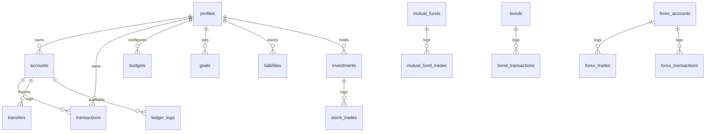

# Database Schema Documentation

This document describes the PostgreSQL database schema for the FinanceOS Personal Finance Dashboard, which is managed via Drizzle ORM schemas and Supabase migration files.

## Entity Relationship Diagram

## Core Tables Reference

### 1. `profiles`
Stores user configuration parameters and settings.
- `id` (UUID, PK): Matches the user ID from Supabase auth.
- `username` (TEXT): Display name.
- `base_currency` (TEXT): Defaults to "INR".
- `theme` (TEXT): Defaults to "dark".
- `timezone` (TEXT): User timezone settings.
- `enabled_modules` (JSONB): Active dashboard feature flags.

### 2. `accounts`
Holds details about user bank, credit card, cash, and investment accounts.
- `id` (UUID, PK)
- `user_id` (UUID, FK -> profiles.id)
- `name` (TEXT): Bank name or custom description.
- `type` (TEXT): e.g. checking, savings, credit, cash.
- `balance` (NUMERIC): Current balance.
- `currency` (TEXT): e.g. INR, USD.

### 3. `transactions`
Records user incomes, expenses, and transaction logs.
- `id` (UUID, PK)
- `user_id` (UUID, FK -> profiles.id)
- `account_id` (UUID, FK -> accounts.id)
- `type` (TEXT): "income" or "expense".
- `amount` (NUMERIC)
- `description` (TEXT)
- `category` (TEXT)
- `date` (TIMESTAMP)

### 4. `ledger_logs`
Immutable double-entry audit trails logging all account balance updates.
- `id` (UUID, PK)
- `user_id` (UUID, FK -> profiles.id)
- `account_id` (UUID, FK -> accounts.id)
- `action_type` (TEXT): e.g. CREATE, UPDATE, TRANSFER.
- `amount` (NUMERIC)
- `previous_balance` (NUMERIC)
- `new_balance` (NUMERIC)

## Row-Level Security (RLS)
Every table is secured with database-level RLS policies.
- **Read & Write Restrictions**: Users are only allowed to view, insert, update, or delete rows where the table's `user_id` matches their own authenticated credentials (`auth.uid()`).
- **Profile Policies**: Read and update permissions on the `profiles` table are strictly constrained to `id = auth.uid()`.
